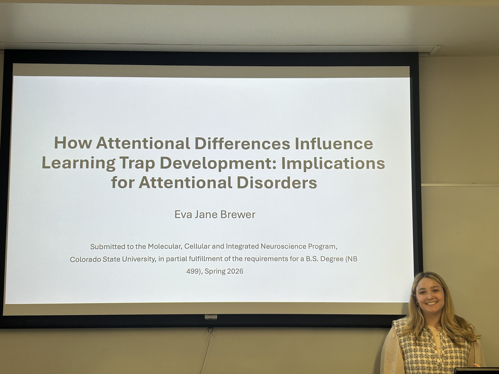
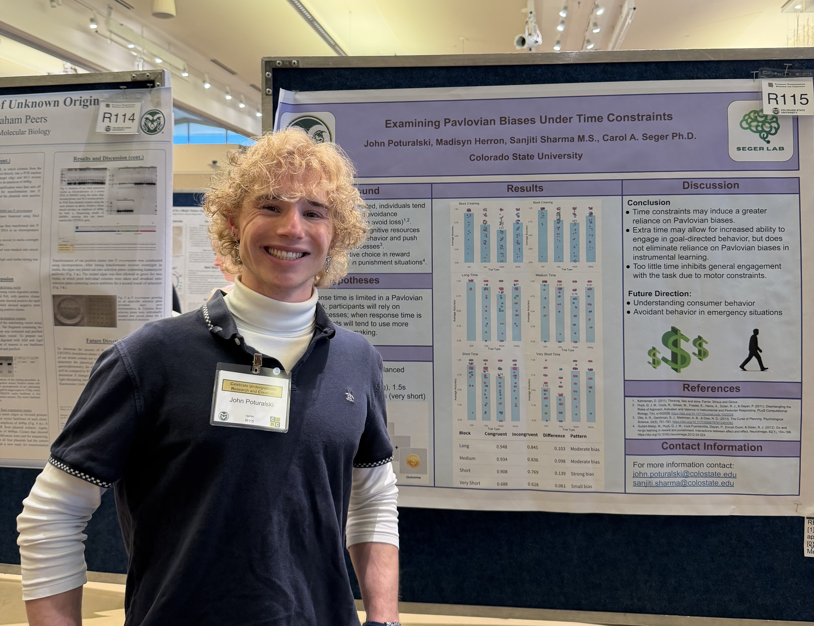
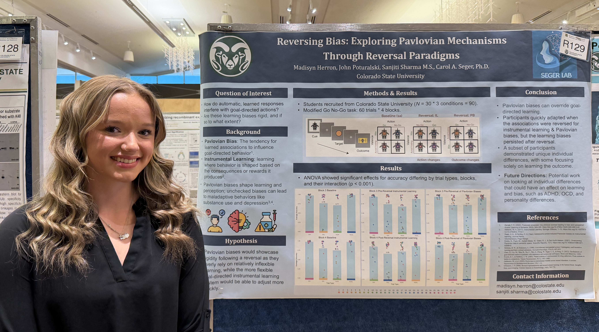
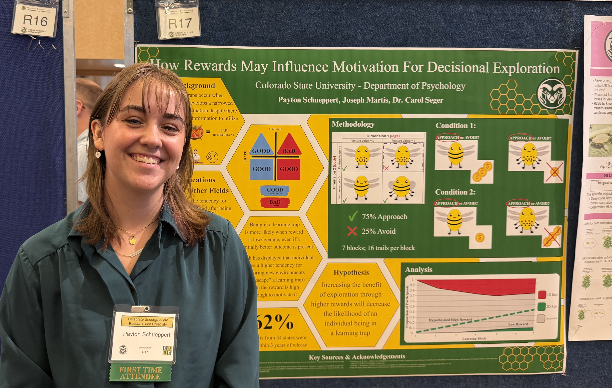
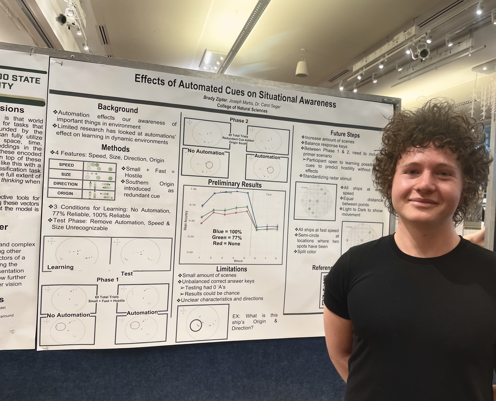
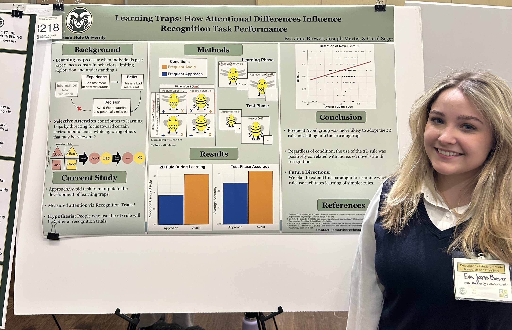
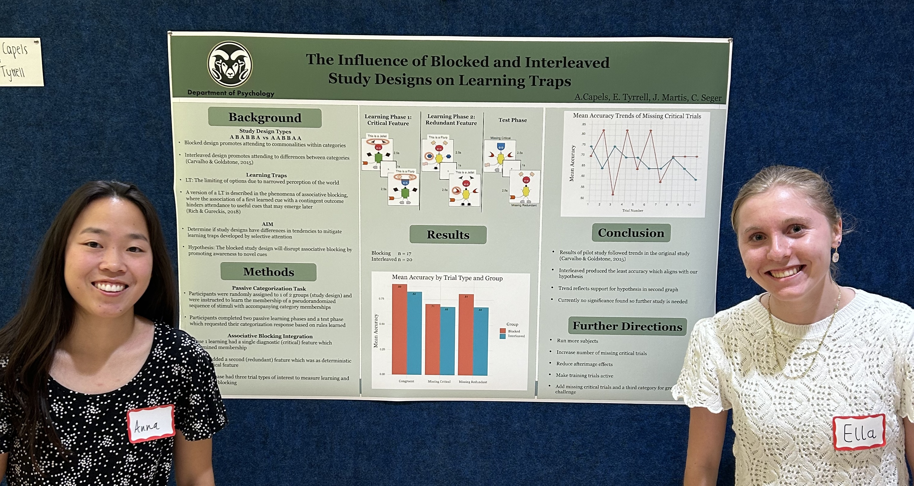

## Category Learning and Mental Representation

One of our primary research areas is characterizing the cognitive and neural systems that underlie learning of new categories and concepts. In addition to examining how corticostriatal networks are involved in category learning (more information below), we are also interested in how categories and concepts are represented in cortex, and how frontoparietal networks are dynamically recruited to support learning and form new knowledge schemas. We combine cognitive experiments with advanced functional MRI analysis techniques including Representational Similarity Analysis, MVPA, and functional connectivity methods. Much of our research in this area is in collaboration with Professor Zhiya "Michael" Liu and his students at South China Normal University.

## The Corticostriatal System

Our core systems neuroscience research examines how interactions between basal ganglia and cortex in corticostriatal "loops" underlie many fundamental aspects of human learning. Much of our research focuses on category learning, which we believe serves as an excellent model system for learning processes generally. We find that different loops make different contributions to category learning. The visual loop helps to process the visual stimulus and map it to the correct category. The motor loop helps to select the correct motor response (e.g., pressing a key on a computer keyboard) to indicate the category. The motivational loop processes the feedback reward associated with categorizing correctly or incorrectly, including calculating a reward prediction error. Finally the executive loop helps to chose the correct strategy for categorization, and works with the motivational loop to process reward and feedback, including predicting the expected feedback or reward associated with each categorization trial.

Our approach to Cognitive Neuroscience is integrative. When studying the corticostriatal system, our goal is to understand its function by combining information from the fields of anatomy, neurophysiology, computational neuroscience, behavior, and cognition. Although our empirical work studies humans we believe it is important to understand the functions of the basal ganglia across species. We also study how the corticostriatal system interacts with other neural systems, such as the hippocampus.

## Translational and Clinical Research

We also have many collaborations through which we examine disorders that affect basal ganglia function.

We study Obsessive-Compulsive Disorder in collaboration with Professor Qi Chen (computational neuroscientist) and Ziwen Peng (Psychiatrist) at South China Normal University. See Publications for a list of our most recent research.

We are beginning collaborative research projects on the role of the tail of the caudate in reward processing in individuals with Substance Use Disorders in collaboration with colleagues at Colorado State University in the Certified Addictions Counseling program.

Past collaborations have examined corticostriatal function in Parkinson disease as well.

## International Collaboration In China

Our lab has extensive collaborations with the School of Psychology, South China Normal University, Guangzhou, China.

Carol Seger holds a Chiang Jiang (Yangtze River) Scholar Chair Professorship at South China Normal (2015-2017). She has completed two sabbaticals in China (2014 and 2022) and visits China for 1-2 months each year to work there and collaborate with faculty and students.

In 2015, CSU and SCNU signed an agreement to established the SCNU-CSU Joint International Laboratory for the Study of Mind and Brain. The picture above shows the CSU delegation along with SCNU administrators at the unveiling of the commemorative plaque.

## Undergraduate Thesis Presentations

{width="3000"}

Undergraduate Student Thesis Spring 2026: Eva Jane Brewer

Graduate Mentor: JoJo Martis

## Undergraduate Research Presentations

{width="3000"}

Undergraduate student presenter: John Poturalski

Graduate Mentor: Sanjiti Sharma

Conference: Celebrating Undergraduate Research and Creativity, Colorado State University, Spring 2026

{width="3000"}

Undergraduate student presenter: Madisyn Herron

Graduate Mentor: Sanjiti Sharma

Conference: Celebrating Undergraduate Research and Creativity, Colorado State University, Spring 2026

{width="3000"}

Undergraduate student presenter: Payton Schueppert

Graduate Mentor: JoJo Martis

Conference: Celebrating Undergraduate Research and Creativity, Colorado State University, Spring 2026

{width="3000"}

Undergraduate student presenter: Brady Zipter

Graduate Mentor: JoJo Martis

Conference: Celebrating Undergraduate Research and Creativity, Colorado State University, Spring 2026

{width="2482"}

Undergraduate student presenter: Eva Jane Brewer

Graduate Mentor: JoJo Martis

Conference: Celebrating Undergraduate Research and Creativity, Colorado State University, Spring 2025

Undergraduate student presenter: Daniel Zepeda

Graduate Mentor: JoJo Martis

Conference: Neurosceince Undergraduate Research Poster Event, Fall 2025

{width="3000"}

Undergraduate student presenter: Anna Capels (Left); Ella Tyrrell (Right)

Graduate Mentor: JoJo Martis

Conference: Neurosceince Undergraduate Research Poster Event, Fall 2024
